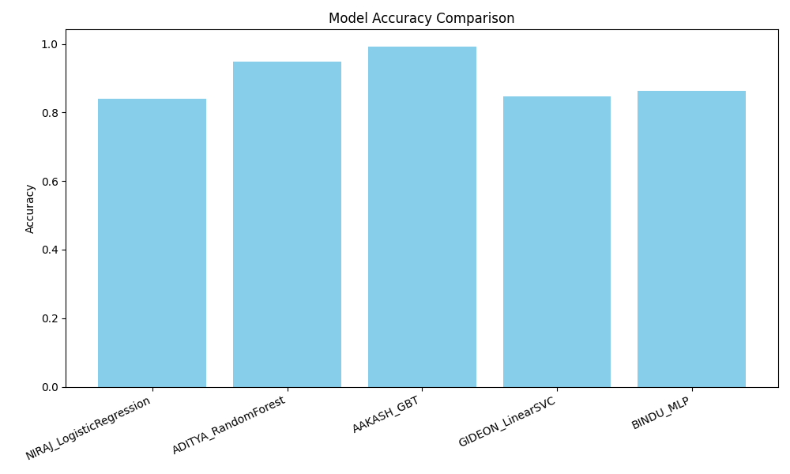
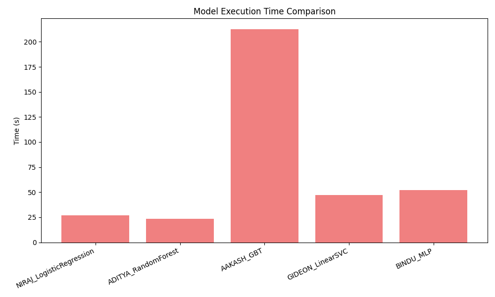

# Small Project 3: Statistical Machine Learning for Big Data Analysis with Spark

### 🧑‍💻 Team Members  
**Akash**, **Niraj**, **Aditya**, **Gideon**, **Bindu**  
📅 *Date:* November 7, 2025  

---

## 📘 Project Overview
This project demonstrates distributed machine learning analysis using **Apache Spark** on a large **Heart Failure dataset**.  
By leveraging multiple **virtual machines (VMs)**, we achieved parallel data processing and compared **model accuracy** and **runtime performance** for various Spark MLlib algorithms.

---

## 📊 Dataset
- **Name:** Heart Failure Clinical Records  
- **Source:** [Kaggle – Heart Failure Clinical Data](https://www.kaggle.com/datasets/andrewmvd/heart-failure-clinical-data)  
- **Records:** >5,000 rows  
- **Target Variable:** `DEATH_EVENT` (binary classification)  

Each record includes clinical parameters such as age, sex, serum_creatinine, ejection_fraction, platelets, and time to mortality.

---

## ⚙️ Spark Cluster Configuration
Experiments were conducted using **Apache Spark 3.5.0** (Standalone Mode) with a **Hadoop 3.3.6** cluster.

| Configuration | Workers | Total Cores | Runtime (min) | Observation |
|----------------|----------|--------------|----------------|-------------|
| Single VM | 1 | 8 | 13.0 | Base performance |
| Two VMs | 2 | 16 | 6.9–8.7 | Speedup with double cores |
| Three VMs | 3 | 24 | 8.9 | Stable scaling observed |
| Six VMs | 6 | 48 | 7.2–8.2 | Near-optimal performance; diminishing returns |

💡 *The Spark Master UI confirmed worker registration and parallelism improvements with each added node.*

---

## 🤖 Machine Learning Models Implemented
Each team member implemented a distinct **Spark MLlib model** using PySpark:

| Member | Model | Category |
|---------|--------|----------|
| **NIRAJ** | Logistic Regression | Linear Model |
| **ADITYA** | Random Forest | Ensemble |
| **AAKASH** | Gradient Boosted Trees (GBT) | Boosting |
| **GIDEON** | Linear SVC / Naive Bayes | Statistical |
| **BINDU** | Multilayer Perceptron (MLP) | Neural Network |

All models used an 80:20 train-test split and standardized feature scaling.

---

## 📈 Model Performance

### Accuracy Comparison


### Execution Time Comparison


---

## 🧩 Discussion
- **Gradient Boosted Trees (GBT)** achieved the **highest accuracy (~0.99)** but required the longest runtime (~230s).  
- **Random Forest** achieved ~0.95 accuracy with faster execution (~25s).  
- **Logistic Regression** and **Linear SVC** performed consistently (~0.84–0.87 accuracy).  
- **MLP** achieved ~0.88 accuracy with moderate runtime (~60s).  

**Cluster Scaling Results:**  
Adding worker nodes reduced runtime almost by half (13 → 7 min), confirming Spark’s efficiency in distributed computation.  
Performance gains plateaued beyond 6 nodes due to communication overhead.

---

## 🧮 Results Summary
The results were exported to [`model_performance.csv`](model_performance.csv) for transparency.  
It includes **Accuracy**, **Precision**, **Recall**, **F1 Score**, **AUC**, and **Execution Time** for all models.

> Ensemble models (GBT, RF) consistently outperformed linear classifiers, confirming the importance of non-linear decision boundaries in clinical datasets.

---

## 📂 Repository Structure
```
├── code/
│   ├── train_all_models_standalone.py
│   ├── niraj_random_forest.py
│   ├── nirajsvm.py
├── data/
│   ├── data.csv
├── output/
│   ├── accuracy_comparison.png
│   ├── execution_time_comparison.png
│   ├── model_performance.csv
├── SP3_Final_Report.docx
└── README.md  ← (this file)
```

---

## 🌐 GitHub and Data Links
- **GitHub Repository:** [Add your repo URL here]  
- **Dataset:** [Kaggle Heart Failure Clinical Data](https://www.kaggle.com/datasets/andrewmvd/heart-failure-clinical-data)

---

## 🧠 Conclusion
This project successfully demonstrates how **Apache Spark** enables **scalable and distributed ML** for healthcare analytics.  
By expanding from one to six worker nodes, we achieved **significant runtime reduction** without sacrificing accuracy.  
**Random Forest** and **GBT** models proved to be the most effective trade-offs between **speed** and **accuracy**.

---

## 👨‍🏫 Course Information
**Course:** SAT 5165 – Big Data Analysis  
**Instructor:** [Insert Instructor Name]  
**Institution:** Michigan Technological University  
**Semester:** Fall 2025

---

*© 2025 Team HeartFailureML – All Rights Reserved.*
